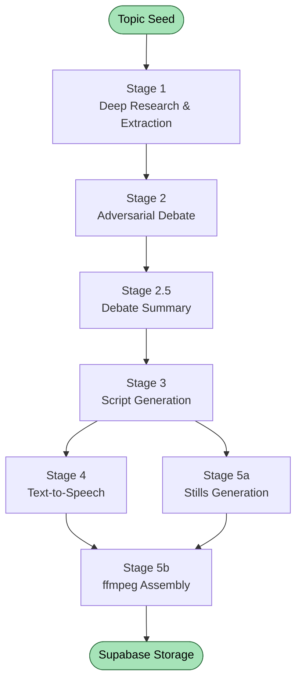

# Verdict

> Turn contested issues into short-form reels you actually watch — every one researched by Gemini, debated between AI agents, and gated behind real engagement so your vote means something.

🥈 **2nd place — Google Track, BeaverHacks 2026**

📺 **[Watch the demo](https://www.youtube.com/watch?v=-sZEXxYC9ws)**

---

## The problem

Information has never been more available, and somehow we've never been less informed. As students, we pull our news from headlines and TikToks and end up with strong opinions on contested issues without ever understanding either side.

Verdict is built to fix that — it fits how we already consume content (vertical reels, FYP scroll), but actually leaves us understanding both sides.

## What it does

- **The Feed** — scroll through trending contested topics (AI Regulation, UBI, etc.)
- **The Series** — selecting a topic launches a curated 6-part reel series, generated end-to-end from Gemini Deep Research output
- **The Deep Dive** — optional briefing with full citations and source content used by the agents
- **The Verdict** — voting screen is gated behind watching all 6 reels. No blind voting.

## How it works

Five stages, all on Gemini.



| Stage | Model | What it does |
|-------|-------|--------------|
| **1 — Research** | `deep-research-max-preview-04-2026` | ~160 web searches per topic, returns a fully cited markdown briefing |
| **1b — Extraction** | `gemini-3-flash-preview` | Parses briefing into structured data + auto-generates the two debate personas |
| **2 — Debate** | `gemini-3.1-pro-preview` (×2) | Two agents argue across 6 rounds (12 turns total). State managed via the Gemini Interactions API's `previous_interaction_id` |
| **2.5 — Summary** | `gemini-3-flash-preview` | Distills 12 turns into the strongest 3–5 points per side |
| **3 — Scripts** | `gemini-3-flash-preview` | Generates 6 fixed-role `ShortScript` records as structured JSON |
| **4 — Audio** | `gemini-2.5-flash-preview-tts` | Role-keyed narration in 3 voices (Charon / Puck / Aoede), 16-bit 24kHz WAV |
| **5a — Stills** | `gemini-2.5-flash-image` (Nano Banana Flash) | 24 vertical 9:16 stills per topic, runs in parallel with Stage 4 |
| **5b — Assembly** | `ffmpeg` | Composes audio, stills, Ken Burns motion, and word-level captions into the final reels |

## Why these model choices?

Cost discipline mattered more than reaching for the most powerful model everywhere. Two decisions drove the rest:

**Pro for the debate, Flash for everything else.** The debate is the highest-leverage stage in the pipeline — weak adversarial reasoning poisons every downstream stage (summary → scripts → audio → stills). It earns the latency and cost. Every other reasoning step is structural (parsing, summarizing, formatting) where Flash holds up at a fraction of the price.

**Nano Banana Flash over the Pro variant.** At 9:16 mobile resolution, quality held up. The savings let us generate 24 stills per topic and keep reels visually varied instead of repetitive.

## Stack

- **Frontend** — React Native (native mobile, targets the audience that already scrolls)
- **Backend** — FastAPI (pipeline orchestration, polling long-running Deep Research jobs, serving reel metadata)
- **Storage / DB** — Supabase (Postgres, MP4 file storage, real-time sync for the live consensus counter)
- **Pre-build design** — Stitch (full app UI mocked before writing code)
- **Infra** — Google AI Studio (paid-tier API access, required for Deep Research Max)

## Repo structure

```
.
├── backend/    # FastAPI — pipeline orchestration, Gemini integration, polling logic
├── frontend/   # React Native — feed, reel player, gated voting UI
└── README.md
```

## Running locally

> ⚠️ Requires paid-tier Google AI Studio access for Deep Research Max.

**Backend**
```bash
cd backend
python -m venv venv && source venv/bin/activate
pip install -r requirements.txt
cp .env.example .env   # add GEMINI_API_KEY, SUPABASE_URL, SUPABASE_KEY
uvicorn main:app --reload
```

**Frontend**
```bash
cd frontend
npm install
npx expo start
```

## What was hard

**Making 5 stages feel like one product.** Behind every reel: a Deep Research call, two debate agents, a summary pass, script generation, TTS, 24 image generations, and an ffmpeg render. The user feels none of it. Hiding that complexity drove every UI decision.

**The agents kept drifting toward agreement.** Personas wanted to be helpful — the opposite of an adversarial debate. The system prompt had to define not just the position, but the refusal to concede. Small wording changes flipped the entire dynamic across all 6 rounds.

**Polling instead of generate.** Deep Research Max runs as a background job, not the standard generate-content pattern. We built polling logic from scratch.

**Half the docs didn't exist yet.** The Gemini Interactions API hit public beta during the build. We figured a lot of it out from changelogs and experimentation.

## Team

- **Pranav Cheraku**
- **Israel Avendano**
- **Jeffrey Guo**

## Awards

🥈 2nd place — Google Track — **BeaverHacks 2026**
